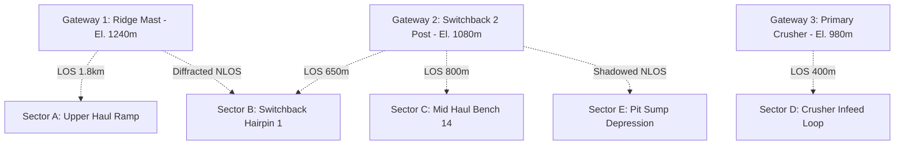

# FOG-ORCHESTRATOR 2.0 — Bailadila RF Field Survey & Validation Plan

**Project:** SIH 2026–27 — Autonomous Fog/Low-Visibility Fleet Orchestrator  
**Document ID:** `DOC-BRF-2026-03`  
**Classification:** Field Survey Protocol & Pre-Registered RF Validation Methodology  
**Target Site:** NMDC Bailadila Iron Ore Mine, Deposit No. 5 (Bacheli Complex, Dantewada District, Chhattisgarh)  
**Author:** Lead Communications Architect & RF Propagation Engineer  
**Validation Level:** **L0/L2 SIMULATION ONLY — PHYSICAL FIELD SURVEY PENDING PERMIT & SITE DEPLOYMENT**

---

## 1. Scope, Limitations & Non-Negotiable Rules

> [!WARNING]
> **Definitive Status Declaration:** No physical RF transmission measurements have been recorded inside the Bailadila Deposit 5 open pit. All RF propagation parameters currently utilized in the Digital Twin (`868 MHz`, `125 kHz BW`, `SF7`, `38.5 ms airtime`) represent benchtop prototype measurements and theoretical Longley-Rice / ITU-R P.526 knife-edge diffraction models. 
> 
> Under no circumstances shall this document or any derived report claim "Bailadila Field Validated" until physical survey execution is completed with logged GPS/RSSI datasets.

---

## 2. Mine Topography & Site Characterization

Bailadila Deposit 5 is one of Asia's largest mechanized open-pit iron ore mines:
* **Elevation Range:** Pit floor at $\sim 920\text{ m}$ MSL to ridge crest at $\sim 1250\text{ m}$ MSL ($330\text{ m}$ vertical relief).
* **Pit Geometry:** High-wall terraced benches ($12\text{ m}$ to $15\text{ m}$ height, $65^\circ - 75^\circ$ slope).
* **Ramp Gradient:** Spiral haul road with sustained $8\% - 10\%$ grades and switchbacks ($R < 35\text{ m}$).
* **Geological Environment:** High-grade Hematite ($\text{Fe}_2\text{O}_3 > 65\%$) and Banded Hematite Quartzite (BHQ). High magnetic susceptibility and surface conductivity cause severe RF multipath, shadowing, and high dielectric attenuation compared to standard suburban or agricultural environments.
* **Atmospheric Environment:** High elevation dense monsoon fog (June–October) and winter radiation fog (December–February), reducing optical visibility to $< 15\text{ m}$.

---

## 3. Pre-Registered Field Failure Criteria (Pre-Test Registration)

Per Section 21 of the Validation Mandate, failure thresholds **must be established before field data collection** to prevent post-hoc bias or opportunistic threshold tuning.

| Metric | Nominal Operational Limit | Degraded Warning Limit | **PRE-REGISTERED HARD FAILURE THRESHOLD** | Autonomous Safety Action |
|:---|:---|:---|:---|:---|
| **RSSI** | $> -95\text{ dBm}$ | $-95\text{ dBm}$ to $-114\text{ dBm}$ | **$\le -115\text{ dBm}$** | Transition to `DEGRADED` RF State |
| **SNR** | $> +2\text{ dB}$ | $-11\text{ dB}$ to $+2\text{ dB}$ | **$\le -12\text{ dB}$** | Clamp safe speed to Caution ($0.6\text{ m/s}$) |
| **Packet Delivery Ratio (PDR)** | $\ge 98.0\%$ | $85.0\% - 97.9\%$ | **$< 85.0\%$ (over 100 packets)** | Enable Safe Beacon broadcast |
| **Over-the-Air Airtime** | $38.5\text{ ms} \pm 1.0\text{ ms}$ | $40.0\text{ ms} - 59.9\text{ ms}$ | **$\ge 60.0\text{ ms}$** | Flag unexpected packet length/spreading shift |
| **Consecutive Packet Loss** | $0$ packets | $1 - 2$ packets | **$\ge 3$ consecutive packets ($> 300\text{ ms}$)** | **Initiate Autonomous Creep ($0.2\text{ m/s}$)** |
| **Gateway Handover Time**| $< 50\text{ ms}$ | $50\text{ ms} - 149\text{ ms}$ | **$\ge 150.0\text{ ms}$** | Hold last known safe trajectory; clamp $v_{\text{safe}}$ |

---

## 4. Multi-Gateway Deployment Topology & Survey Sectors

### 4.1 Designated Field Survey Test Points (25 Critical Waypoints)

| Waypoint ID | Site Location Description | Expected Line-of-Sight | Elevation (m MSL) | Distance to Nearest GW (m) | Key Test Focus |
|:---|:---|:---|:---|:---|:---|
| **WP-01 to 05** | Ridge Haul Road (East Crest) | Direct LOS to GW1 | 1235–1250 | 100–450 | Free-space baseline, max signal strength |
| **WP-06 to 10** | Upper Ramp (Bench 8 to 11) | Partial Fresnel Obstruction | 1140–1200 | 500–900 | Multipath reflection from hematite bench |
| **WP-11 to 14** | Switchback 1 Hairpin ($R=28\text{ m}$) | Severe NLOS to GW1; LOS to GW2 | 1090–1110 | 120 (to GW2) | Gateway Handover & Hysteresis Test |
| **WP-15 to 18** | Mid-Pit Ramp (Bench 14 to 17) | LOS to GW2; NLOS to GW3 | 1020–1060 | 400–750 | Sustained 8% grade telemetry integrity |
| **WP-19 to 22** | Switchback 2 & Crusher Approach | NLOS to GW2; Direct LOS to GW3 | 970–990 | 150 (to GW3) | Secondary Handover & High Electrical Noise |
| **WP-23 to 25** | Deep Sump Basin (Pit Floor) | Extreme NLOS (Highwall Shadow) | 920–935 | 1100 (diffracted) | Edge-of-coverage failover to Safe Beacon |

---

## 5. Field Survey Execution Procedure

### 5.1 Mobile Survey Rig Instrumentation
* **Survey Vehicle:** 4WD Field Vehicle fitted with calibrated test rig:
  1. **Primary RF Transceiver:** Semtech SX1262 / SX1278 evaluation module connected to calibrated $+3\text{ dBi}$ omnidirectional magnetic-mount dipole at $2.2\text{ m}$ height.
  2. **Spectrum Analyzer:** Rohde & Schwarz FPH Handheld Spectrum Analyzer (monitoring ISM noise floor and ambient inter-modulation).
  3. **High-Precision GNSS:** RTK-GNSS receiver with $< 2\text{ cm}$ horizontal / $< 5\text{ cm}$ vertical positioning accuracy.
  4. **Data Logger:** Ruggedized industrial PC logging packets at $20\text{ Hz}$ with microsecond hardware timestamps synchronized via GPS PPS (Pulse Per Second).

### 5.2 Dynamic Survey Protocol
1. **Drive Runs:** The survey vehicle traverses the haul route from Ridge (WP-01) to Sump (WP-25) at controlled speeds ($15\text{ km/h}$, $25\text{ km/h}$, $35\text{ km/h}$).
2. **Packet Transmission:** Transmit standardized 32-byte binary telemetry frames every $50\text{ ms}$ ($20\text{ Hz}$).
3. **Data Recording:** For each packet, log:
   - Packet Sequence ID
   - GPS Latitude, Longitude, Altitude (MSL)
   - Vehicle Instantaneous Speed ($v$)
   - Active Gateway ID (`GW-01`, `GW-02`, `GW-03`)
   - Measured RSSI ($\text{dBm}$)
   - Measured SNR ($\text{dB}$)
   - Packet CRC Error Flag (0 = Pass, 1 = Fail)
   - Round-Trip Time / Latency ($\text{ms}$)
4. **Repeatability:** Perform 3 ascending runs and 3 descending runs during clear dry conditions, followed by 3 runs during dense fog / precipitation conditions.

---

## 6. Coverage Map Generation & Modeling Ground Rules

When field data is retrieved:
1. **No Unbounded Spline/Kriging Interpolation:** 
   - Unsurveyed high-wall or inaccessible bench regions shall **not** be populated with optimistic interpolated signal contours.
   - Any contour cell $> 50\text{ m}$ from a measured GPS coordinate must be explicitly rendered in a striped hatch pattern labeled:
     `MODELED VIA KNIFE-EDGE DIFFRACTION — UNMEASURED`.
2. **Output Artifacts Required:**
   - `results/rf_validation/bailadila_measured_rssi_map.png`
   - `results/rf_validation/bailadila_measured_pdr_map.png`
   - `results/rf_validation/bailadila_handover_zones.csv`
   - `results/rf_validation/bailadila_nlos_blackspots.csv`
