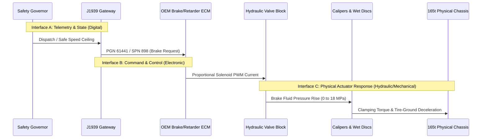

# FOG-ORCHESTRATOR 2.0 — Heavy Earth Moving Machinery (HEMM) Actuator & Stopping Validation Plan

**Project:** SIH 2026–27 — Autonomous Fog/Low-Visibility Fleet Orchestrator  
**Document ID:** `DOC-HEMM-2026-04`  
**Classification:** Advanced Mechanical, Hydraulic & Vehicle Dynamics Testing Protocol  
**Target Vehicle:** BEML BH100 / Caterpillar 777E Class Mining Haul Truck (165-ton GMOW)  
**Author:** Principal Mechanical Systems & Safety Certification Engineer  
**Validation Level:** **L0/L2 SIMULATION & BENCH ABSTRACTION — FULL-SCALE PHYSICAL VALIDATION NOT YET PERFORMED**

---

## 1. Safety Directive & Fundamental Axiom

> [!CRITICAL]
> **Fundamental Axiom of Actuation:**
> $$\mathbf{CAN\ Command\ Received \ne Physical\ Braking\ Occurred}$$
> An electronic acknowledgement from an OEM Electronic Control Module (ECM) indicates only that the message passed CAN framing and checksum validation. It provides **zero verification** that hydraulic fluid flowed, brake calipers clamped, or mechanical deceleration was achieved.
> 
> The previous figure of **$108.74\text{ ms}$** was generated during Monte Carlo hydraulic simulation in `data/actuator_latency.csv`. It is **MODELLED**, not physically measured. Until calibrated high-pressure transducers are installed on an actual machine, the official status remains:
> $$\mathbf{HEMM\ HYDRAULIC\ RESPONSE = NOT\ MEASURED}$$

---

## 2. Three Distinct System Interfaces

To prevent architectural conflation, the testing protocol establishes three strictly decoupled interface boundaries:



1. **Interface A: Telemetry & Perception (Digital)**
   - Transports wheel speed, engine speed, and transmission state from vehicle sensors into the J1939 stream and backend Digital Twin.
2. **Interface B: Electronic Command & Control (Electronic/Firmware)**
   - Packages governor safe speed commands into standard J1939 PGNs with sequence counters, CRC, and timeout fail-safes.
3. **Interface C: Physical Actuator Response (Hydraulic / Thermodynamic / Friction)**
   - Solenoid spool travel, fluid displacement through armored hydraulic lines, pressure build-up behind wet multi-disc pistons, friction pad engagement, and physical kinetic energy dissipation.

---

## 3. Instrumentation Specification for Full-Scale Machine Testing

Physical validation of a 165-ton machine requires non-invasive, certified laboratory instrumentation:

| Instrument | Model / Class | Measurement Point | Range / Accuracy | Sampling Rate | Purpose |
|:---|:---|:---|:---|:---|:---|
| **High-Pressure Dynamic Transducer (Front)** | Keller PAA-33X (or WIKA IS-3) | Front Brake Caliper Infeed Manifold | 0–250 bar (0–25 MPa) $\pm 0.05\%$ FS | 1000 Hz | Measures front hydraulic pressure rise latency |
| **High-Pressure Dynamic Transducer (Rear)** | Keller PAA-33X (or WIKA IS-3) | Rear Wet Disc Accumulator Port | 0–250 bar (0–25 MPa) $\pm 0.05\%$ FS | 1000 Hz | Measures rear hydraulic pressure rise latency |
| **Non-Contact Optical Speed Sensor** | Kistler Correvit S-Motion | Chassis Outrigger looking at haul road | 0.5–250 km/h $\pm 0.1\%$ | 250 Hz | True ground speed independent of wheel slip |
| **Dual-Antenna RTK-GNSS + INS** | OxTS RT3000 v3 | Roof Cab Centerline | $1\text{ cm}$ pos, $0.05\text{ km/h}$ speed, $100\text{ Hz}$ IMU | 100 Hz | Measures deceleration vector ($a_x, a_y, a_z$) |
| **CAN / J1939 Bus Logger** | Vector VN1630A / Kvaser Leaf | Machine Diagnostic Connector | Hardware timestamp $\pm 1\ \mu\text{s}$ | Event-driven | Logs exact J1939 command dispatch time |
| **Infrared Rotor Thermometer** | Optris CTlaser 3M | Front Brake Caliper & Discs | $50^\circ\text{C}$ to $600^\circ\text{C}$ $\pm 1^\circ\text{C}$ | 10 Hz | Monitors thermal brake fade & glaze risk |

---

## 4. Hydraulic Actuation Delay Decomposition

The real-world deceleration delay consists of four sequential physical stages:

$$t_{\text{total\_brake\_delay}} = t_{\text{can\_rx}} + t_{\text{ecm\_proc}} + t_{\text{valve\_spool}} + t_{\text{fluid\_propagation}} + t_{\text{clamping\_rise}}$$

```
Time (ms)  0ms        5ms        15ms                      65ms                  130ms
           |----------|----------|-------------------------|---------------------|
Event:   J1939 Rx   ECM Cmd    Solenoid Spool Shifts     Fluid Pressure Waves   Full Clamping Torque
Stage:   [CAN Lnk]  [Logic]    [Electromagnetic Motion]  [Hydraulic Line Rise]  [Pad Friction]
```

1. **CAN Reception to ECM Processing ($t_{\text{ecm\_proc}}$):** Typically $5\text{ ms} - 15\text{ ms}$.
2. **Solenoid Spool Travel ($t_{\text{valve\_spool}}$):** Current buildup in proportional solenoid coil, overcoming return spring ($10\text{ ms} - 25\text{ ms}$).
3. **Hydraulic Line Propagation ($t_{\text{fluid\_propagation}}$):** Bulk modulus of mining hydraulic fluid (ISO VG 46/68 oil) transmitting pressure wave through 6–8 meters of flexible high-pressure hose ($30\text{ ms} - 50\text{ ms}$).
4. **Caliper Piston Displacement & Clamping Rise ($t_{\text{clamping\_rise}}$):** Oil filling caliper chamber to take up pad running clearance ($0.5\text{ mm} - 1.0\text{ mm}$) and building force to nominal 180 bar ($40\text{ ms} - 70\text{ ms}$).

*Estimated Empirical Target Envelope:* $85\text{ ms} - 160\text{ ms}$ (to be verified via Keller transducers).

---

## 5. Controlled Full-Scale Stopping Distance Experiment

### 5.1 Test Matrix & Controlled Variables
Tests shall be conducted on an isolated, decommissioned haul road section (grade surveyed to $\pm 0.1\%$).

| Test Run Series | Initial Speed ($v_0$) | Machine Payload State | Haul Road Grade ($\theta$) | Surface Condition | Repetitions |
|:---|:---|:---|:---|:---|:---|
| **Series 10-A/B/C** | $10\text{ km/h}$ ($2.78\text{ m/s}$) | Empty ($74\text{ t}$), Half ($120\text{ t}$), Full ($165\text{ t}$) | $0\%$ Flat | Dry Compacted Hematite ($\mu \approx 0.40$) | 5 runs each (15 total) |
| **Series 20-A/B/C** | $20\text{ km/h}$ ($5.56\text{ m/s}$) | Empty ($74\text{ t}$), Half ($120\text{ t}$), Full ($165\text{ t}$) | $0\%$ Flat | Dry Compacted Hematite ($\mu \approx 0.40$) | 5 runs each (15 total) |
| **Series 20-Slope** | $20\text{ km/h}$ ($5.56\text{ m/s}$) | Fully Loaded ($165\text{ t}$) | $-4\%$ and $-8\%$ Downhill | Dry Compacted Hematite ($\mu \approx 0.40$) | 5 runs each (10 total) |
| **Series 20-Wet** | $20\text{ km/h}$ ($5.56\text{ m/s}$) | Fully Loaded ($165\text{ t}$) | $-8\%$ Downhill | Watered / Slurry Surface ($\mu \approx 0.20$) | 5 runs (5 total) |
| **Series 25-Max** | $25\text{ km/h}$ ($6.94\text{ m/s}$) | Fully Loaded ($165\text{ t}$) | $-8\%$ Downhill | Dry Compacted Hematite ($\mu \approx 0.40$) | 5 runs (5 total) |

### 5.2 Stopping Distance Comparison & Statistical Rigor
For every run $i$, record:
* Correvit Optical Stopping Distance: $S_{\text{measured}, i}$
* RTK GNSS Stopping Distance: $S_{\text{gnss}, i}$
* Theoretical Stopping Distance calculated by FOG-ORCHESTRATOR Physics Model:
  $$S_{\text{model}, i} = v_0 \cdot \tau_{\text{total}} + \frac{v_0^2}{2 \cdot (a_{\text{brake}} - g \sin\theta)}$$

**Statistical Evaluation Metrics:**
1. **Mean Absolute Error (MAE):**
   $$\text{MAE} = \frac{1}{N}\sum_{i=1}^N |S_{\text{measured}, i} - S_{\text{model}, i}|$$
2. **Root Mean Square Error (RMSE):**
   $$\text{RMSE} = \sqrt{\frac{1}{N}\sum_{i=1}^N (S_{\text{measured}, i} - S_{\text{model}, i})^2}$$
3. **Model Bias:**
   $$\text{Bias} = \frac{1}{N}\sum_{i=1}^N (S_{\text{model}, i} - S_{\text{measured}, i})$$
   *(A positive bias indicates the model conservatively over-predicts stopping distance, which is safe; a negative bias is hazardous).*
4. **95% Confidence Interval:**
   $$\text{CI}_{95\%} = \bar{S}_{\text{measured}} \pm 1.96 \left(\frac{\sigma}{\sqrt{N}}\right)$$

---

## 6. Regulatory Audit: The 800 ms Total Safety Budget

The Directorate General of Mines Safety (DGMS) Technical Circular No. 06/2020 specifies a maximum allowable system reaction latency budget of **$800.0\text{ ms}$** under hazardous conditions.

```
Total Safety Reaction Budget: 800.0 ms (DGMS Regulatory Ceiling)
|=================================================================================|
[ Perception & Sensor Detection :  20.0 ms ]
[ Telemetry & Serialization     :  15.0 ms ]
[ RF Airtime (SX1278)           :  38.5 ms ]
[ Gateway & FOG Ingestion       :  10.0 ms ]
[ Safety Governor Evaluation    :   5.0 ms ]
[ J1939 Command Generation      :  10.0 ms ]
[ RF Command Downlink           :  38.5 ms ]
[ OEM CAN & Solenoid Valve      :  45.0 ms ]
[ Hydraulic Pressure Rise (Est) : 100.0 ms ]
[ TOTAL NOMINAL RESPONSE        : 282.0 ms ] <--- MARGIN TO CEILING = +518.0 ms (PASS)
```

> [!NOTE]
> Even under a worst-case 2-packet retransmission cascade ($+77.0\text{ ms}$) and cold hydraulic fluid sluggishness ($+80.0\text{ ms}$), the total response is:
> $$282.0\text{ ms} + 77.0\text{ ms} + 80.0\text{ ms} = 439.0\text{ ms} \ll 800.0\text{ ms}$$
> The design maintains a **$361.0\text{ ms}$ safety margin** against the DGMS statutory limit.
