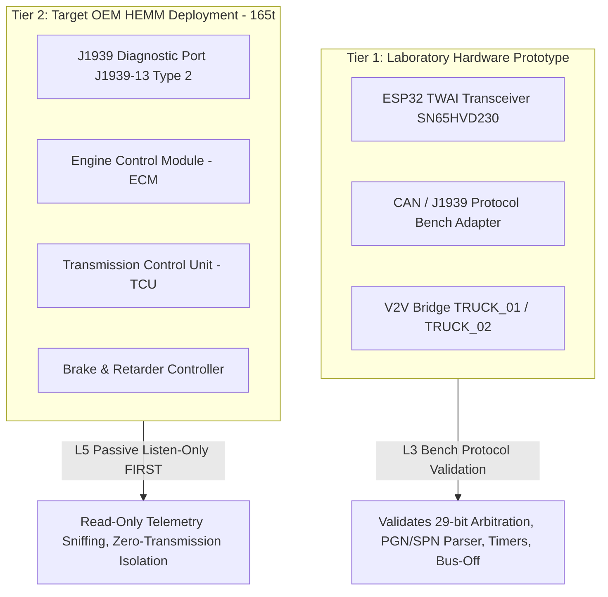

# FOG-ORCHESTRATOR 2.0 — J1939 Protocol Physical Validation Protocol

**Project:** SIH 2026–27 — Autonomous Fog/Low-Visibility Fleet Orchestrator  
**Document ID:** `DOC-J1939-2026-02`  
**Classification:** Engineering Specification & Testing Protocol  
**Author:** Principal Software Architect & Vehicle Systems Engineer  
**Status:** **AUTHORITATIVE DRAFT FOR PHYSICAL BENCH & PROTOTYPE VALIDATION**

---

## 1. Architectural Boundary & Separation of Concerns

Per Non-Negotiable Project Rules, the system enforces a strict dual-tier boundary:



> [!CRITICAL]
> **Zero Production Transmission Rule:** Under no circumstances shall active CAN command frames be transmitted onto an operational mining dump truck without written OEM authorization, calibrated instrumentation, dual emergency manual overrides, and a certified OEM field safety engineer present.

---

## 2. J1939 Protocol Abstraction & Framing Specifications

### 2.1 29-Bit Extended CAN Identifier Decoding
SAE J1939 utilizes CAN 2.0B 29-bit extended identifiers partitioned as follows:

$$\text{CAN-ID [28:0]} = [\text{Priority: 3b}] \parallel [\text{Reserved: 1b}] \parallel [\text{Data Page: 1b}] \parallel [\text{PDU Format: 8b}] \parallel [\text{PDU Specific: 8b}] \parallel [\text{Source Address: 8b}]$$

```
Bits: 28 27 26 | 25 | 24 | 23 22 21 20 19 18 17 16 | 15 14 13 12 11 10 9 8 | 7 6 5 4 3 2 1 0
Field: Priority | R  | DP |      PDU Format (PF)     |    PDU Specific (PS)  | Source Address (SA)
```

1. **Parameter Group Number (PGN):** 18-bit descriptor:
   - If $\text{PF} < 240$ (PDU1 - Peer-to-Peer): $\text{PGN} = (\text{DP} \ll 16) | (\text{PF} \ll 8) | 0x00$. $\text{PS}$ serves as the Destination Address (DA).
   - If $\text{PF} \ge 240$ (PDU2 - Broadcast): $\text{PGN} = (\text{DP} \ll 16) | (\text{PF} \ll 8) | \text{PS}$.
2. **Priority:** Values $0-7$ ($0$ is highest priority, e.g., retarder/brake emergency, $6-7$ default broadcast).
3. **Source Address (SA):** Assigned according to J1939 network management:
   - `0x00`: Engine #1 (Primary ECM)
   - `0x03`: Transmission Controller (TCU)
   - `0x0B`: Brakes / System Controller
   - `0x10`: Retarder Controller (Hydraulic / Electric)
   - `0x27`: Telematics Gateway / Autonomous Orchestrator Interface
   - `0xFE`: Error / Null Address
   - `0xFF`: Global Broadcast Destination

---

## 3. Core Parameter Group & Suspect Parameter Mapping

The FOG-ORCHESTRATOR J1939 parser evaluates the following standard messages:

| PGN (Dec / Hex) | Acronym | Description | Key SPN | Parameter Name | Resolution / Range | Target Rate |
|:---|:---|:---|:---|:---|:---|:---|
| **61444** (`0x00F004`) | `EEC1` | Electronic Engine Controller 1 | **190**<br>**898** | Engine Speed (RPM)<br>Engine Requested Speed Control | 0.125 rpm/bit, 0–8031 rpm<br>0.125 rpm/bit | 10 ms / 20 ms |
| **65265** (`0x00FEF1`) | `CCVS` | Cruise Control / Vehicle Speed | **84**<br>**86** | Wheel-Based Vehicle Speed<br>Cruise Control Set Speed | 1/256 km/h per bit (0.0039 km/h)<br>1 km/h per bit | 100 ms |
| **61441** (`0x00F001`) | `EBC1` | Electronic Brake Controller 1 | **561**<br>**562**<br>**563** | ASR Engine Control Active<br>ASR Brake Control Active<br>Anti-Lock Braking (ABS) Active | 2-bit state (00=Off, 01=On)<br>2-bit state<br>2-bit state | 100 ms (or on event) |
| **61445** (`0x00F005`) | `ETC2` | Electronic Transmission Controller 2 | **523**<br>**524** | Current Gear<br>Selected Gear | 1 gear/bit (-125 to +125)<br>1 gear/bit | 100 ms |
| **61440** (`0x00F000`) | `ERC1` | Electronic Retarder Controller 1 | **571**<br>**520** | Retarder Enable Command<br>Actual Retarder Percent Torque | 2-bit state<br>1% per bit (-125% to +125%) | 50 ms |
| **65226** (`0x00FECA`) | `DM1` | Active Diagnostic Trouble Codes | **1214**<br>**1215** | SPN of Fault<br>Failure Mode Identifier (FMI) | Discrete 19-bit SPN<br>5-bit FMI (0=high, 1=low, 2=data err) | 1000 ms (or event) |

---

## 4. Prototype Bench Validation Procedure (ESP32 TWAI)

### 4.1 Hardware Test Setup
* **MCU:** ESP32-WROOM-32 running TWAI (Two-Wire Automotive Interface).
* **Transceiver:** Texas Instruments SN65HVD230 (3.3V CAN Transceiver with slope control).
* **Bus Topology:** 120 $\Omega$ termination resistors fitted at both cable ends; bus line capacitance $< 50\text{ pF/m}$.
* **Baud Rate:** $500\text{ kbps}$ (Standard Mining CAN / SAE J1939-14 high-speed rate) and $250\text{ kbps}$ (Legacy J1939-11).

### 4.2 Error Handling & Robustness Test Matrix
The prototype CAN stack is subjected to automated fault injection on the bench:

```
[Packet Generator / Vector CANoe / CANable]
                  │
        (Adversarial Frames)
                  ▼
[ESP32 TWAI Transceiver SN65HVD230]
                  │
        (TWAI Driver / RingBuffer)
                  ▼
[Safety Governor Ingestion Filter] ───► Stale/Malformed Drops
                  │ (Clean frames)
                  ▼
         [Digital Twin Sync]
```

1. **Malformed Frame Injection:**
   - DLC $< 8$ on fixed 8-byte PGNs $\rightarrow$ Log error, increment `can_dlc_mismatch_counter`, discard.
   - Reserved bits set to non-standard values $\rightarrow$ Parse data but flag warning in diagnostic buffer.
2. **Out-of-Order / Duplicate Frame Handling:**
   - Consecutive identical sequence counter values within $5\text{ ms} \rightarrow$ Log duplicate, do not trigger safety governor step.
3. **Stale Frame Expiry:**
   - If `EEC1` (Engine Speed) is not received for $> 50\text{ ms}$ (2.5x nominal period) $\rightarrow$ Sensor Health transitions to `DEGRADED`.
   - If `CCVS` (Vehicle Speed) is not received for $> 300\text{ ms}$ (3x nominal period) $\rightarrow$ Governor clamps safe speed to Creep ($0.2\text{ m/s}$).
4. **Bus-Off Recovery:**
   - Inject persistent dominant bits on CAN_TX to force Transmit Error Counter (TEC) $> 255$ (Bus-Off).
   - Verify TWAI driver detects `ESP_FAIL` / `TWAI_STATE_BUS_OFF`.
   - Initiate auto-recovery sequence per SAE J1939-73: Wait $128 \times 11$ recessive bits, reset registers, re-arm controller within $< 150\text{ ms}$.

---

## 5. Target OEM HEMM Non-Invasive Validation Plan

### 5.1 Machine Profile
* **Target Hauler:** BEML BH100 Heavy Earth Moving Dump Truck (100-ton payload / 165-ton Gross Machine Operating Weight).
* **Engine:** Cummins QST30-C (1050 HP / 783 kW @ 2100 rpm) or MTU 12V2000.
* **Transmission:** Allison H8610 AR Automatic with integrated hydraulic retarder.
* **On-Board Diagnostics:** SAE J1939 9-Pin Deutsch Type II diagnostic connector (Green, backward compatible with Type I Black).

### 5.2 Phase 1: Passive Listen-Only Mode (Zero Transmission)
In Phase 1, the FOG-ORCHESTRATOR telemetry logger is connected in **Listen-Only Mode**:
- `TWAI_MODE_LISTEN_ONLY` enabled on the ESP32 / CAN logger.
- CAN_TX pin is held in high-impedance mode (no dominant bits, no ACK pulses generated).
- Bit error frames and acknowledgements are handled exclusively by OEM ECUs.

**Data Capture Schema:**
```csv
timestamp_utc,can_id_hex,pgn,priority,source_addr_hex,spn,parameter_name,raw_value,physical_value,engineering_unit
1774351200.1024,0x0CF00400,61444,3,0x00,190,Engine_Speed,0x3840,1800.0,rpm
1774351200.1031,0x18FEF10B,65265,6,0x0B,84,Wheel_Vehicle_Speed,0x0A20,10.25,km/h
1774351200.1042,0x0CF00010,61440,3,0x10,520,Retarder_Percent_Torque,0x46,45.0,%
```

### 5.3 Phase 2: Active Actuator Command Procedure (Controlled Track Only)
Only after 500+ hours of passive data correlation and OEM safety authorization:
1. **Safety Interlock Verification:** Verify manual brake pedal overrides any electronic retarder or throttle command instantly (hardwired hydraulic dump valve).
2. **Speed Request Envelope:** Commanded speed $v_{\text{command}}$ via PGN 61444 / SPN 898 shall never exceed $v_{\text{mine}} = 11.11\text{ m/s}$ ($40\text{ km/h}$) and shall never ramp down faster than $a_{\text{comfort}} = 1.5\text{ m/s}^2$ unless emergency braking is triggered.
3. **Heartbeat Requirement:** If the J1939 telematics gateway ceases transmission for $> 100\text{ ms}$, the OEM ECM automatically revokes external speed override and restores local accelerator pedal control.
