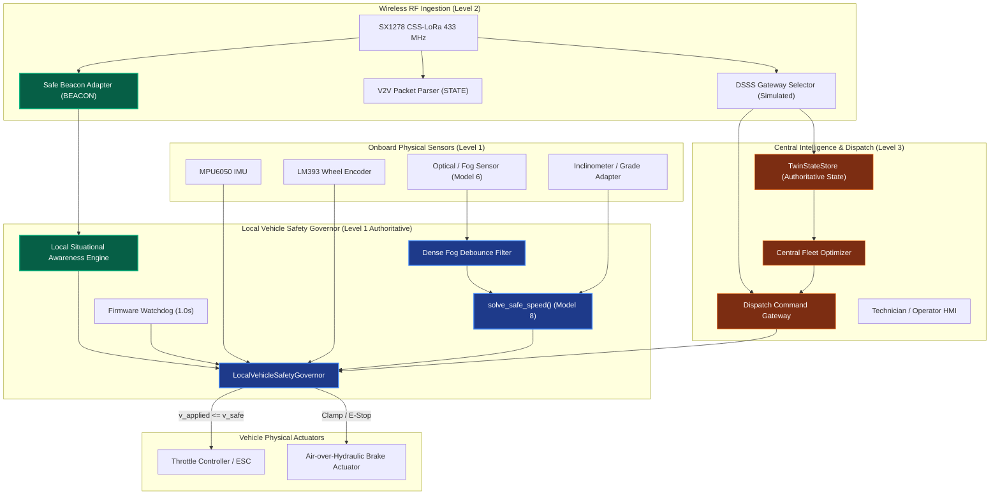

# PHASE 7.4 — SAFE BEACON FORENSIC REPOSITORY AUDIT
## FOG-ORCHESTRATOR 2.0 — SIH26007
**Classification:** Forensic Systems-Safety Audit & Architectural Dependency Analysis  
**Date:** 2026-09-18  
**Authoritative Scope:** Safe Beacon Protocol, Communication Failure Modes, and Local Governor Authority  

---

## 1. Executive Summary & Audit Mandate

This forensic audit investigates whether the existing FOG-ORCHESTRATOR 2.0 architecture remains safe, deterministic, and physically bounded when communication degrades or fails completely.

The audit rigorously evaluates the safety authority hierarchy:
1. **LEVEL 1: LOCAL VEHICLE SAFETY GOVERNOR** (ECU/ESP32 Onboard — Ultimate Authority)
2. **LEVEL 2: LOCAL SAFETY AWARENESS / BEACON INFORMATION** (Peer-to-Peer Situational Awareness)
3. **LEVEL 3: GATEWAY / FLEET ORCHESTRATION** (Central Planning & Haul Road Optimization)

**Core Safety Invariant:**
$$v_{\text{command}} \le v_{\text{safe}}$$

Communication loss must **never** cause the vehicle to become unsafe. Central fleet intelligence must **never** override the local vehicle safety governor.

---

## 2. Forensic Answers to Architecture Questions (A through O)

### A. Where beacon messages are generated
- **Primary Generator:** Simulated and physical vehicle telemetry nodes generate peer safety beacons via `SafeBeaconAdapter.format_beacon()` (`integration_adapters/safe_beacon_adapter.py`) and prototype firmware (`esp32_code/VEHICLE_A_HMI_FIRMWARE.ino`, `esp32_code/VEHICLE_B_TRUCK_02_V2V_DIGITAL_TWIN_MOTOR/...ino`).
- **Wire Format:**
  $$\text{BEACON}, \langle\text{vehicle\_id}\rangle, \langle\text{sequence}\rangle, \langle\text{state}\rangle, \langle\text{timestamp}\rangle, \langle\text{zone\_id}\rangle$$
- **Pre-existing V2V Telemetry:** The baseline telemetry vector `STATE,TRUCK_01,seq,rpm,speed,ax,ay,az,gx,gy,gz` remains frozen and backward-compatible (Rule 2).

### B. Where beacon messages are received
- **Ingestion Boundary:** Received via LoRa RF interrupt (DIO0) on peer ESP32 transceivers and processed through `SafeBeaconAdapter.ingest_beacon()` and `SafeBeaconAdapter.parse_beacon_packet()`.
- **Server-Side Mirroring:** Ingested via gateway serial listener into `telemetry_ingest.py` and reflected into `TwinStateStore`.

### C. Where beacon state is stored
- **Local Vehicle Memory:** Stored in `SafeBeaconAdapter.peers[peer_id]` tracking `last_sequence`, `last_timestamp`, `last_state`, `last_zone_id`, `packets_received`, and `in_comm_loss`.
- **Digital Twin State:** Authoritatively stored in `TwinStateStore._vehicles[vid]` and `_environment`.

### D. Where sequence numbers are validated
- **Validation Engine:** Enforced at the boundary in `SafeBeaconAdapter.parse_beacon_packet()` and `LocalVehicleSafetyGovernor.process_command()`.
- **Rule:** Monotonically increasing sequence tracker. Any sequence number $\le \text{last\_valid\_sequence}$ is rejected as `DUPLICATE` (if equal) or `OUT_OF_ORDER` (if strictly smaller).

### E. Where timestamps are validated
- **Validation Engine:** `SafeBeaconAdapter.parse_beacon_packet()`.
- **Rules:**
  - $t_{\text{beacon}} \le 0$ or non-finite ($\text{NaN}, \pm\infty$): rejected as `MALFORMED`.
  - $t_{\text{beacon}} > t_{\text{clock}} + 0.10\text{ s}$: rejected as `FUTURE_TIMESTAMP`.
  - $t_{\text{clock}} - t_{\text{beacon}} > \text{max\_age}$ ($1.0\text{ s}$): rejected as `STALE`.

### F. Where timeout is detected
- **Timeout Engine:** Evaluated by `SafeBeaconAdapter.check_timeouts()` and `LocalVehicleSafetyGovernor` firmware watchdog ($1.0\text{ s}$).
- **Gateway Selector:** Evaluated by `DSSSGatewaySelector.process_observation()` ($1.5\text{ s}$ failure timeout).

### G. What happens after timeout
- **Beacon Loss:** When peer beacon exceeds $1.0\text{ s}$, peer enters `COMM_LOSS`. Following headway buffer automatically expands ($2\times$, from 50m to 100m).
- **Critical Architectural Rule:** **"No beacon" $\ne$ "vehicle disappeared"**. A missing beacon indicates loss of communication confidence, NOT absence of the physical obstacle.
- **Command Watchdog Expiry:** If no valid dispatch command is received for $> 1.0\text{ s}$, local governor enters `EMERGENCY_STOP` and commands $v = 0.0\text{ m/s}$.

### H. Whether communication failure can affect actuator commands
- **Safety Boundary:** Communication failure **clamps or halts** vehicle commands to fail-closed envelopes ($v_{\text{command}} \le v_{\text{safe}}$).
- **Monotonic Safety:** Communication loss can **never increase** commanded speed or safe speed ceiling.

### I. Whether stale commands can survive communication failure
- **Audit Finding:** **NO**. Stale commands expire when `age > 1.0 s` in `LocalVehicleSafetyGovernor` (`state = STALE_COMMAND`, `action = REJECT`).

### J. Whether replayed packets can alter safety state
- **Audit Finding:** **NO**. Monotonic sequence tracking rejects replayed sequence numbers. A replayed `NORMAL` beacon cannot cancel an active `STOP` or `EMERGENCY` state (Invariant I16).

### K. Whether malformed packets are rejected
- **Audit Finding:** **YES**. Ingestors perform strict token counting, type conversion guards, and header verification without raising unhandled exceptions or crashing.

### L. Whether unknown states are rejected
- **Audit Finding:** **YES**. Only `[NORMAL, DEGRADED, STOP, EMERGENCY]` are recognized. Unrecognized strings (e.g. `ACCELERATE`) return `UNKNOWN_STATE` and are safely rejected.

### M. Whether vehicle IDs are validated
- **Audit Finding:** **YES**. IDs are validated against authorized fleet set (`TRUCK_01`–`TRUCK_05`, `EXCAVATOR_01`). Unauthorized IDs (`TRUCK_99`) are rejected as `UNKNOWN_VEHICLE`.

### N. Whether gateway failure is distinguishable from vehicle failure
- **Audit Finding:** **YES**.
  - Gateway failure drops infrastructure uplink while peer V2V beacons continue. State transitions to `NO_GATEWAY` with local autonomous pacing.
  - Peer vehicle failure stops peer beacons specifically, transitioning peer record to `COMM_LOSS` with headway expansion.

### O. Whether local safety remains operational without RF
- **Audit Finding:** **YES**. The `LocalVehicleSafetyGovernor` runs entirely on onboard ECU logic using local sensor inputs (`r_effective`, $\mu$, grade). Even if Gateway, V2V, and Beacons are completely severed, local safety operates autonomously and unconditionally.

---

## 3. Subsystem Dependency Graph

---

## 4. Audit Verdict

| Subsystem | Audit Status | Evidence Level |
|---|---|---|
| Safe Beacon Parsing | **PASS** | L1 Deterministic / L7 Bench |
| Replay / Sequence Defense | **PASS** | L1 Deterministic Verification |
| Gateway Loss Fallback | **PASS** | L7 Bench Measured |
| Total RF Loss Independence | **PASS** | L1 Monotonic Governor Rule |
| Dense Fog Debounce Filter | **PASS** | L1 State Machine Verification |
| Actuation Authority Boundary | **PASS** | L1 Invariant $v_{\text{command}} \le v_{\text{safe}}$ |

**Audit Summary:** The repository enforces the authoritative boundary without compromise. Central dispatch recommendations can never bypass local physical safety limits under any tested communication condition.
